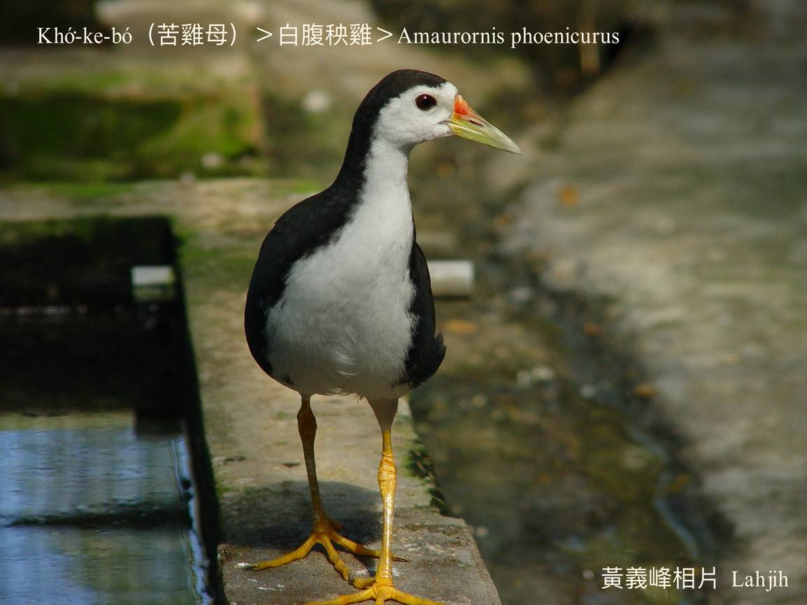
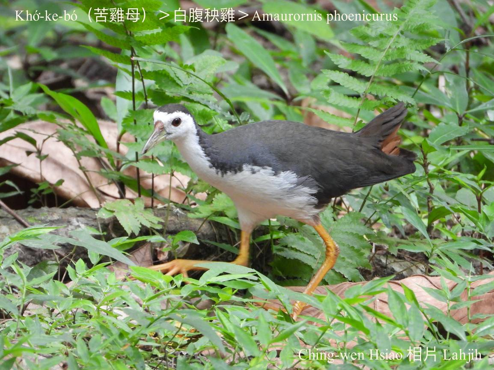
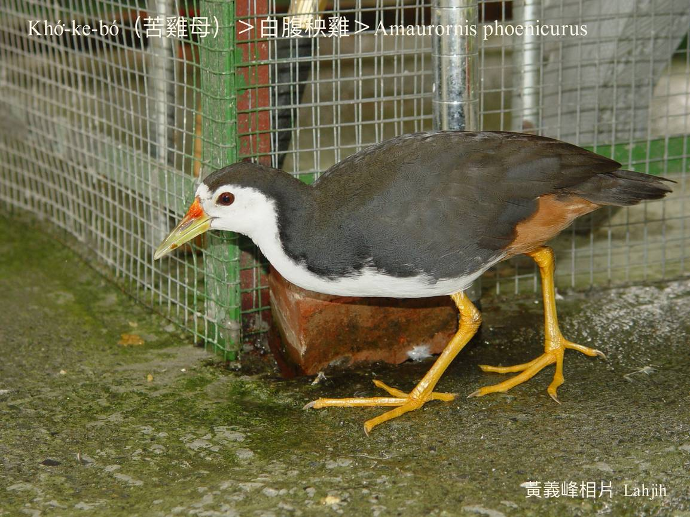
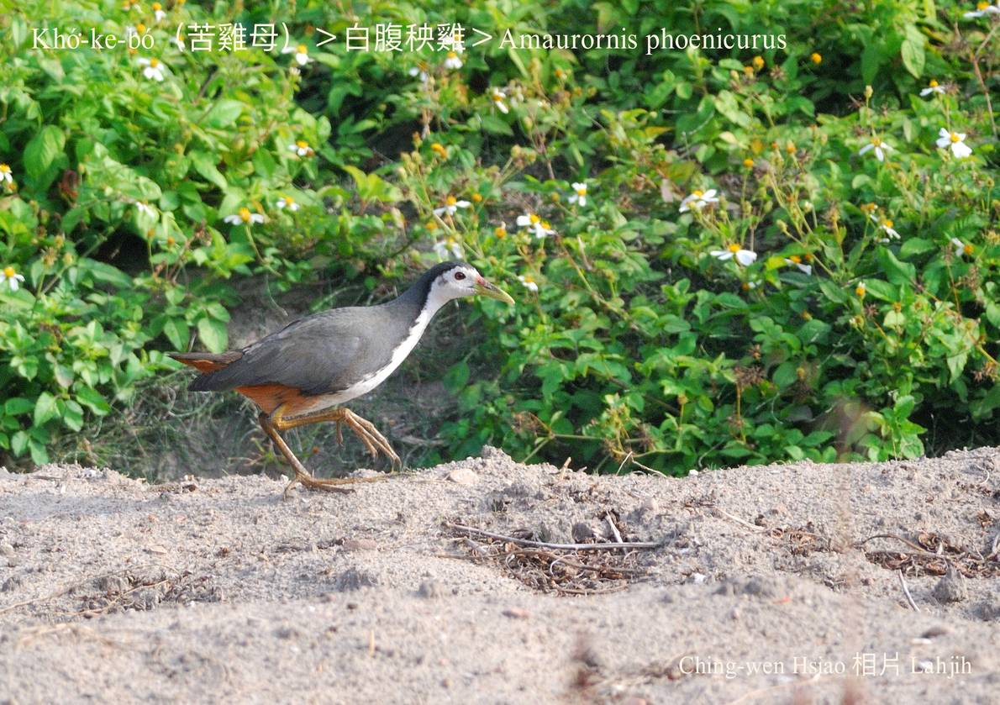
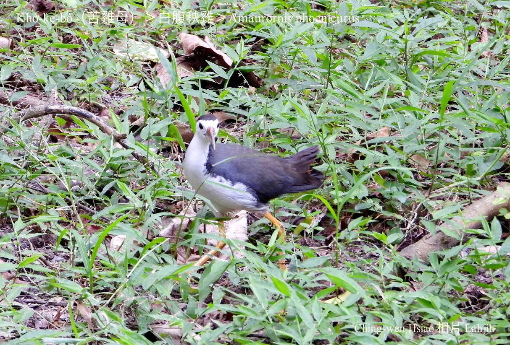
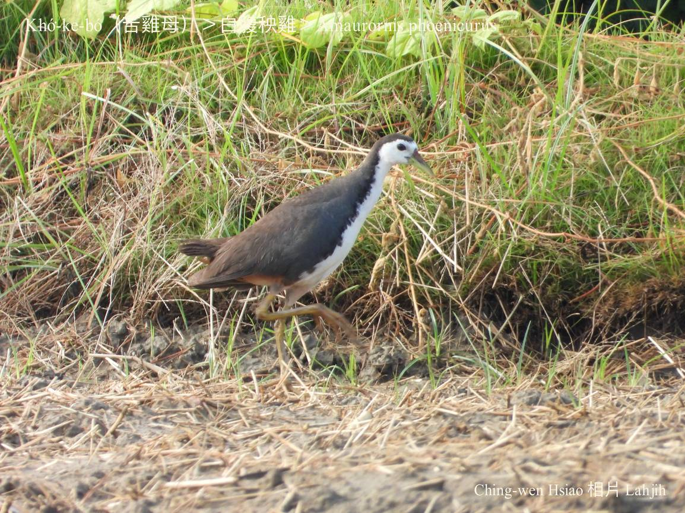
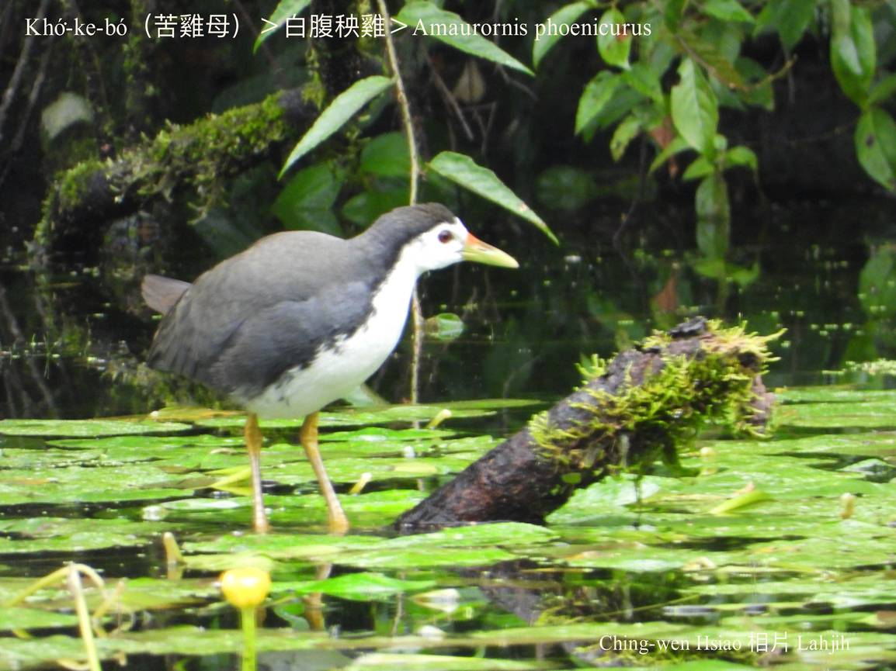
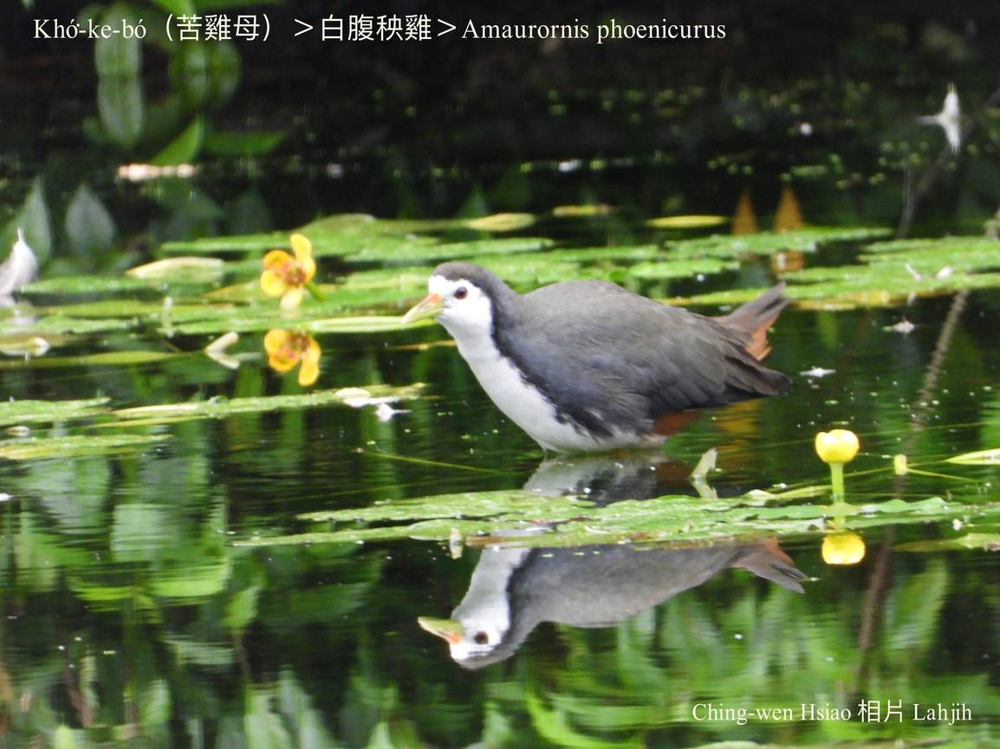

#### 13. Iong-ke kho『秧雞科』

|台灣名|中譯名|學名|
|Khó͘-ke-bó（苦雞母）|白腹秧雞|Amaurornis phoenicurus|

# 13-2. Khó͘-ke-bó（苦雞母）

Khó͘-ke-bó生湠期間，暝也háu，日也háu，一直háu「khó͘--à khó͘--à khó͘--à khó͘--à⋯。」Háu bē soah，m̄-chiah hō͘庄腳人號做「苦雞母」。

Khó͘-ke-bó tī台灣是chiâⁿ普遍ê在地鳥，bih tiàm水田、lòm地、溪岸邊有廬竹、雜草內，罕得飛，mā飛bē koân。

Khó͘-ke-bó頭、ām、胸坎下面lóng是白色，頭殼、kha-phiaⁿ是o͘-phú色，kha-chhng周圍紅猴色，m̄-chiah有人kā叫做「白面á」，「紅kha-chhng-á」。

苦雞母發音是khó͘-ke-bó a̍h是khó͘-koe-bó，有人漢字寫做苦瓜母，sui-bóng發音kāng-khoán，含意恐驚無合。

### 俗語

「苦雞母，生苦雞á-kiáⁿ。」

「Hit-lō蛇，生hit-lō卵，hit-lō kiáⁿ，生bē斷。」

「Gîm-chîⁿ水，滴原位。」

# 【Tâi-oân Chiáu-á Liām Koa-si】

### **Khó͘-ke-bó Seⁿ Khó͘-ke-á-kiáⁿ**

Seⁿ-chò ná pe̍h-bīn-su-seng 

Ná ē chiah-nī kiaⁿ kiàn-siàu

Bih-tiàm iap-thiap só͘-chāi

Bô-ài gōa-kháu khòaⁿ kong-kéng

Khòaⁿ lí chhōa-kiáⁿ chū-iû chū-chāi 

Sī án-chóaⁿ 

Lí mê ā háu, khó͘--à khó͘--à!

Ji̍t ā háu, khó͘--à khó͘--à!

Háu kah hō͘-lâng sim-chêng khí ut-chut

Khó͘-ke bó seⁿ khó͘-ke-á kiáⁿ

Si̍t-chāi hō͘ lâng chin m̄-kam

### Âng-kha-chhng-á ê記智
>**20230411 Lahjih**

古早阿公留hō͘阿爸四分厝腳田，to̍h-tī厝宅後尾門外口，hia是gín-á時ê bîn-bāng，tī chia khau草、挽菜、趕雞趕鳥，khioh田螺、lia̍h水蛙、sńg田水、ho͘水萍、走相jiok⋯。有時ka-tī孤chi̍t-ê，有時gín-á伴絞做夥，有時hō͘阿爸kin leh做工。Koh是學校讀冊出入siāng輕鬆ê路站，國校七冬罕得ùi頭前門去學校。

Hit-chūn水田--lī除了ē-tàng khioh田螺、lia̍h水蛙，mā有鱔魚、hô͘-liu、àm-kóng-sai lò蟹á thang lia̍h，稻á nā-boeh好割，粟鳥á to̍h來空襲偷食，有時o͘-khâm-khâm趕也趕bē走，害死ài-sńg ê Lahjih m̄敢離開，一枝hop-hop-á giâ-tiâu-tiâu，行來走去，趕到日頭落海，鬼á出來放屎chiah敢轉去食飯。

Hit-tang-chūn記智siāng深--e iáu有客鳥、pan-kah、bi̍t-lô-á，hām chi̍t-khoán有thiaⁿ kìⁿ聲無khoàiⁿ tio̍h影ê âng-kha-chhng-á。

Âng-kha-chhng-á khah chia̍p出現tī boeh暗á時，bat khoàiⁿ i ê烏影tī稻田走，i ê háu聲khiok是聽kah真熟似。

有時「koak koak koak koak」，有時「koa̍k koa̍k koa̍k koa̍k」，有時koh-ē牽聲「koăk koăk koăk koăk」，chiok好聽mā chiok恐怖，因為是tī暗昏。

Sui-bóng m̄-bat khoàiⁿ，m̄-koh gín-á伴lóng知影he是âng-kha-chhng-á leh háu。

Âng-kha-chhng-á kha-chhng紅紅，猴山áさるkha-chhng mā紅紅，Lahjih to̍h是らじ，m̄知gín-á伴án-chóaⁿ ka choa̍h-im，soah kāらじchoa̍h tùiさる，chiah koh kā Lahjih keng-thé做さる さる紅kha-chhng，さる さる紅kha-chhng，有kúi ê gín-á伴to̍h án-ne叫我âng-kha-chhng-á。

知影gín-á伴叫thit-thô叫好sńg，咱mā無受氣，m̄-koh mā無接受，咱是笑笑無ka應聲，叫久無回應，chit ê偏名chū-án-ne無tiâu名，猶原叫Lahjih Lahjih--è。

### 苦雞母ê故事

古早古早，有chi̍t-ê作田人，生兩ê kiáⁿ，大漢--ê是前某生--ê，細漢--ê是後siū生--ê。後母苦毒前人kiáⁿ是古早人ê pháiⁿ風俗，chit ê做人後母ê人，自然無an好心，想khang想phāng boeh害chit ê前人kiáⁿ。

伊命令兩ê kiáⁿ各人chah青皮á豆ê種子，去後山荒郊野外tiām，吩咐nā無生豆á thang收成，bē-sái轉--來。伊偷偷á將sa̍h過ê種子交hō͘大漢kiáⁿ，將有生命力ê好種子交hō͘ ka-tī ê親生kiáⁿ，兩兄弟á聽tio̍h阿母ê話to̍h出發行向後山boeh種豆á。

阿兄是有孝koh古意，老母ê kau-tài m̄敢ûi-ge̍k，種子kōaⁿ--leh，ná行ná想boeh án-chóaⁿ種作，chiah bē hō͘阿母失望；小弟to̍h無kāng-khoán，人講「hit-lō蛇，生hit-lō卵，hit-lō kiáⁿ，生bē斷。」有影pháiⁿ種to̍h是pháiⁿ種，伊沿路行沿路sńg無停，m̄是boeh lia̍h鳥á，to̍h是boeh kā阿兄chhòng-tī，無張持看tio̍h阿兄ê種子大粒koh飽tīⁿ，想講阿母ná-ē大細心，疼大兄無疼我小弟？Ĕ，án-ne m̄-tio̍h，在來阿母to̍h疼我無疼阿兄，ah，大概阿母無小心kiat m̄-tio̍h--去，soah kā大粒--ê hō͘阿兄，細粒--ê交hō͘我，che boeh thài ē-sái-tit，to̍h利用hioh-khùn ê sî-chūn kā阿兄ê種子偷換倒轉--來。

時間過了也不止á緊to-tio̍h，春去秋來，收成ê節氣到--à，阿兄肩頭taⁿ一大擔ê青皮á豆轉--來，iáu-koh chhun一大堆boeh hō͘小弟tàu相添，m̄-koh小弟種ê種子lóng bē puh芽，chi̍t-sut-á收成mā無，soah m̄敢轉--來，chit-ê後母總是知影「gîm-chîⁿ水，滴原位。」Ka-tī造惡ka-tī受，m̄敢講出因由，雖然大漢--ê hit-ê前人kiáⁿ非常有孝ka安慰，叫i免煩惱，小弟一定會倒轉--來，m̄-koh母kiáⁿ連心，親生kiáⁿ是老母ê一塊肉，bē堪得暝日思念，一直等無i ê kiáⁿ轉--來，因為過度悲傷惹出重病，soah一命來o͘-ho͘ ai-chai，死了化做一隻苦雞母，暝也háu，日也háu，一直háu bē-soah，一直háu「khó͘--à khó͘--à khó͘--à khó͘--à⋯」teh思念i ê親生kiáⁿ。

### 【註解】

|詞|解說|
|khoàiⁿ|Khòaⁿ-kìⁿ ê合音。|
|水萍|Chúi-phiô，『浮萍』。|
|暗昏|Àm-hun，黃昏。|