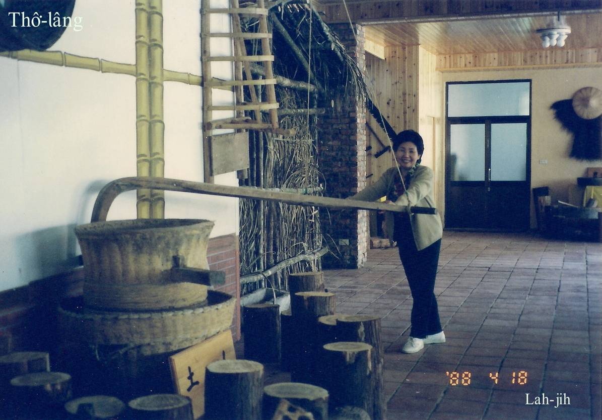

#### 15. U̍t kho『鷸科』

|台灣名|中譯名|學名|
|Thô͘-lâng-kau-á（土礱鉤á）|大杓鷸|Numenius arquata|

# 15-3. Thô͘-lâng-kau-á（土礱鉤á）

Thô͘-lâng-kau-á ê嘴pe長長，尾á勾勾，kài sêng古早時代挨粟á ê土礱勾á。

Thô͘-lâng-kau-á是普遍ê冬候鳥，大部分出現tī西部海邊沙埔，大肚溪口南岸kap彰濱工業區ê沙埔地，是siāng大ê度冬地，有時出現2000外隻，hō͘人叫是海埔新生地。

Thô͘-lâng-kau-á（Numenius arquata），是台灣ê過冬鳥，i有chúi-chiam-á鳥類siāng長嘴pe，i ê長嘴ǹg下面彎曲，親像古早e粟á ê土礱鉤，chiâⁿ特別。

冬天到香山海邊濕地看鳥，有真大機會ē-tàng看--tio̍h，是kui大陣做夥chhōe食。

Thô͘-lâng-kau-á（Numenius arquata），是giōng-boeh絕種ê鳥類。

