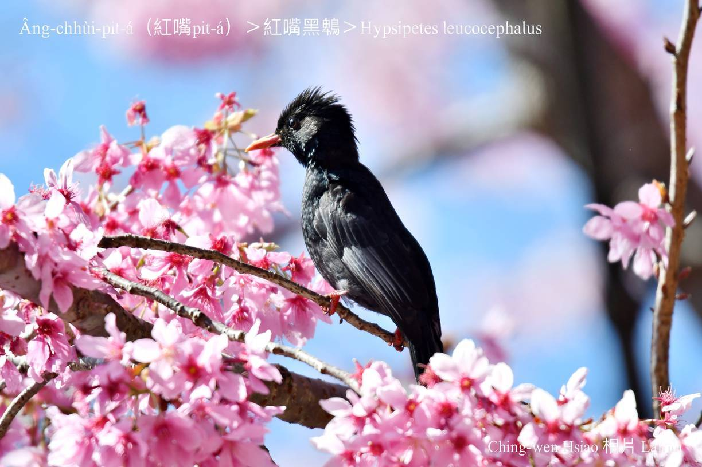
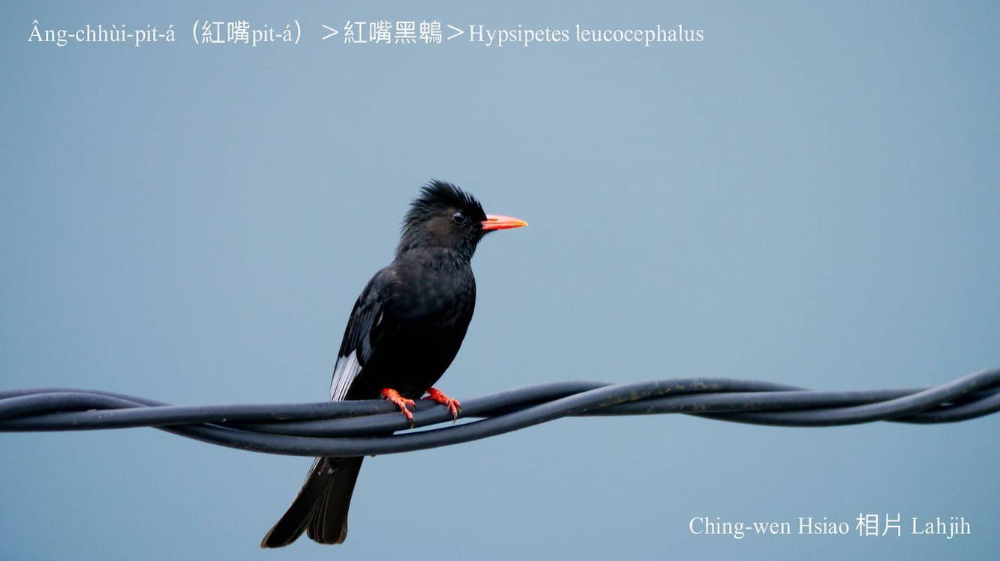
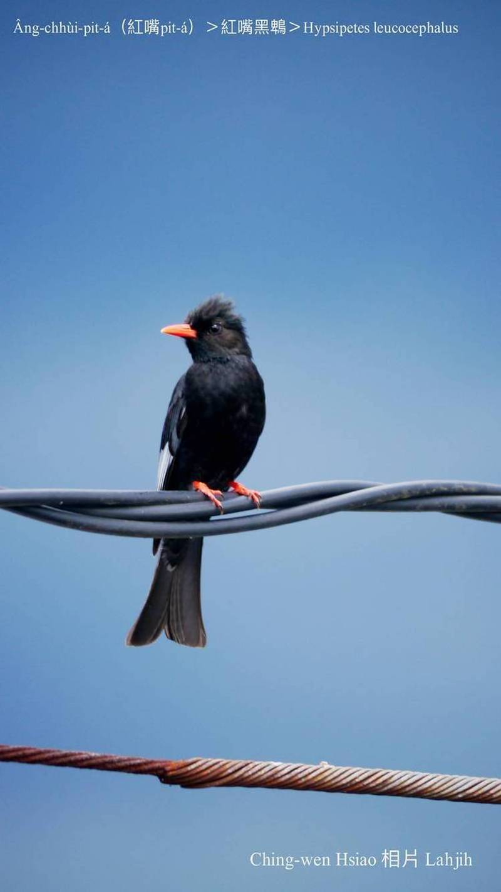
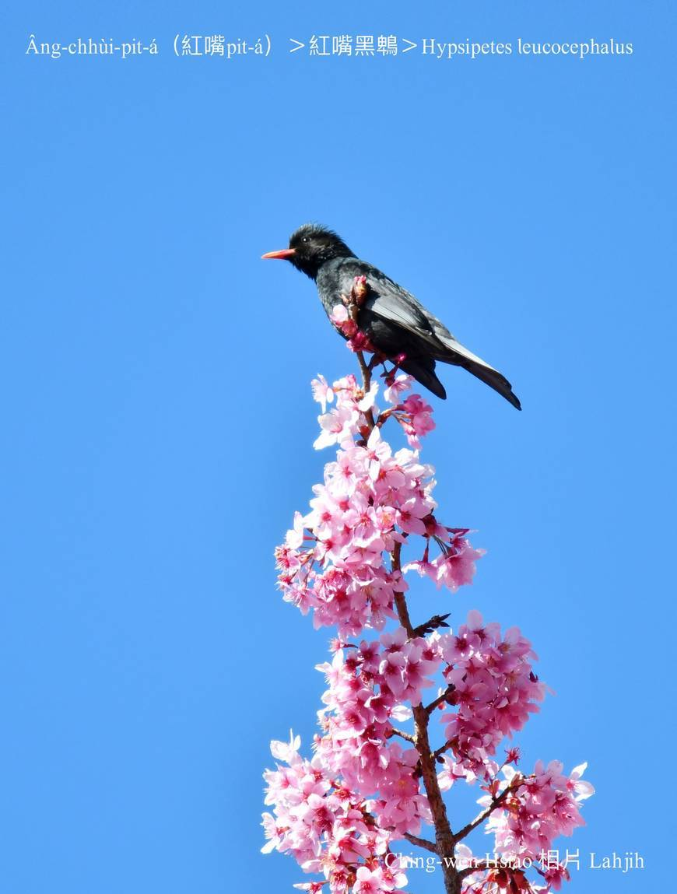
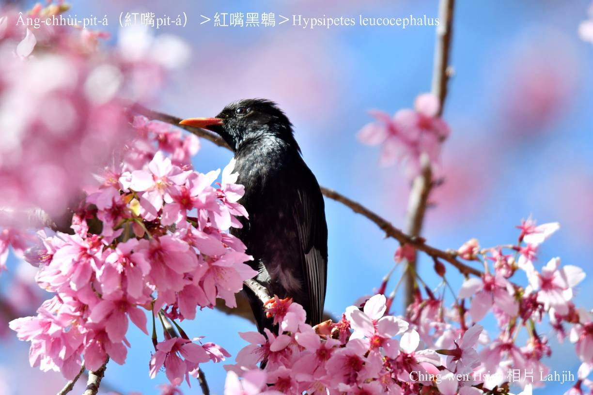
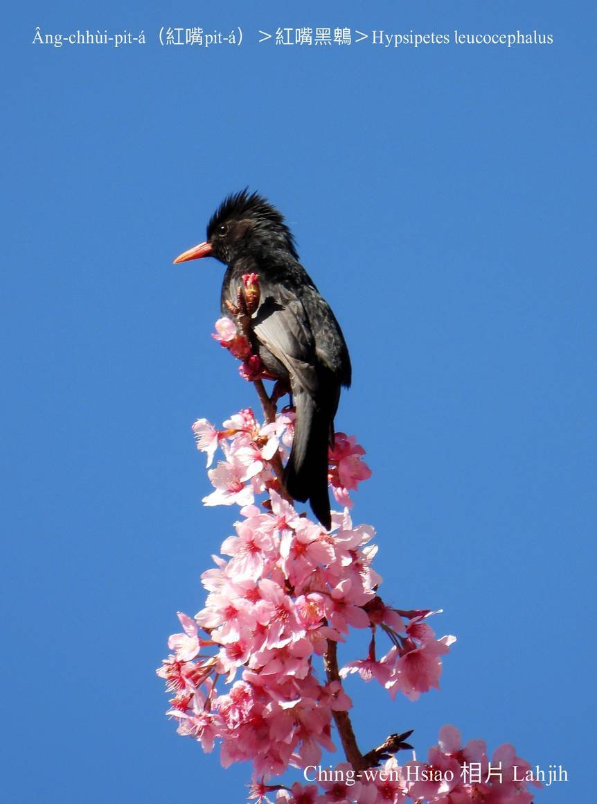
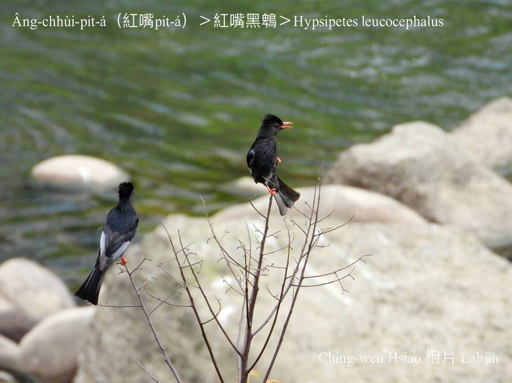

#### 34. Pit-kho『鵯科』

|台灣名|中譯名|學名|
|Âng-chhùi-pit-á（紅嘴pit-á）|紅嘴黑鵯|Hypsipetes leucocephalus|

# 34-4. Âng-chhùi-pit-á（紅嘴pit-á）

Âng-chhùi-pit-á，kui身是烏色羽毛，金sih-sih，kan-na嘴pe kap兩支腳是紅色--ê，鳥公鳥母外形sio-kāng，看起來ná烏鶖--leh，mā號做紅嘴烏鶖。

Âng-chhùi-pit-á ē絞群活動，有時幾隻niâ，有時ē kui大tīn，tī koân大樹頂ta椏跳來跳去飛來飛去，kah意中低海拔公園、學校樹頂活動。

Âng-chhùi-pit-á tī台灣是普遍在地鳥mā是台灣特有種。

### **勇敢ê Qepis — Lahjih**
>**Bunun âng-chhùi-pit-á ê故事**

傳說太古時代，Bunun ê鄉野山區出現1尾chiok大尾ê蟒蛇，危害精牲動物，sńg-tn̄g山園果子食物，而且koh向人類挑戰，用伊ê法力kā山坑á出口nâ截，hō͘山坑á水無teh消tháu，soah ta̍k四界淹水，hō͘ Bunun ê族人無厝thang tòa，無家可歸，有夠落魄苦憐，不得已只好逃難到玉山頂，chit時火種已經hō͘水lâm hoa--去，無法度煮食，玉山頂koh寒sih-sih，無火thang烘，也iau也寒，實在無法度koh生存--落-去。

Ko͘-put-lī-chiang，經過Bunun酋長kap長老參詳會議，決定boeh拜託動物來tàu-saⁿ-kāng，其中siāng-kài重要ê khang-khòe to̍h是引火種轉來部落，chiah有才調hō͘族人繼續活命--落-去。頭起先拜託蟾蜍大--ê泅水到對岸ê卓社大山boeh取火種，蟾蜍大--ê提tio̍h火種to̍h趕緊跳落去山坑á水--裡，火種隨時hoa--去，蟾蜍大--ê無達成任務，感覺chiâⁿ iàn-khì，soah bih tiàm水內m̄敢見人；koh來有niáu鼠、獐á、鹿á、山豬…lóng boeh來tàu幫忙試khòaⁿ-māi，可是lóng無才調潦過hit條有水ê坑溝á，ta̍k ê人lóng非常失望，m̄知影boeh án-chóaⁿ chiah好？

突然間，半空中飛來1隻鳥á：「Hō͘我來試khòaⁿ-māi--leh kám ē-sái-tit？」

「你--ō͘？Chiah-nī細隻，chiah-nī幼秀，kám有法度擔當chit-ê任務？Hiah-nī chē ê朋友兄弟lóng來tàu腳手，lóng無伊法，你是boeh用siáⁿ-mih步數來完成chit-ê khang-khòe--leh？」

「Hō͘我試khòaⁿ-māi--leh-lah！憑我ê熱誠kap勇氣，hō͘我來試khòaⁿ-māi--leh-lah！」

「好！既然ta̍k-ê lóng無法度，to̍h拜託你試khòaⁿ-māi--leh？」酋長án-ne回答，ta̍k-ê lóng知影che是不得已--ê。
Chit隻鳥á叫做Qepis，伊是1隻真特別ê鳥á，生做chiâⁿ súi，chiâⁿ幼秀，伊既然答應人boeh提火種轉來hō͘ ta̍k-ê煮食、烘火，伊to̍h chiâⁿ勇敢飛過坑溝á到卓社大山，用伊ê嘴pe咬1支燒hōm-hōm ê火種，無khà欣賞山裡ê súi光景，kan-nā一直piàⁿ命飛，看ē-tàng khah緊飛轉去Bunun ê部落，解救hiah-nī chē ê性命--bô？

Qepis ná飛風ná透，風愈透火愈猛，soah燒tio̍h伊khi̍p火種ê hit支正腳，ko͘-put-lī-chiang趕緊kā火種換到tò腳，ân-ân kā挾tiâu--leh，千萬m̄-thang phah ka-la̍uh去，飛愈緊，火愈猛，tò腳已經擋bē-tiâu--ā，無用嘴pe來咬bē-sái-chit，尾á伊用嘴pe咬hit支火種，歸尾總是ka咬轉來部落，kui-ê部落ê性命自án-ne得tio̍h解救，ta̍k-ê歡喜kah目屎流目屎滴，lóng來感謝Qepis ê勇敢kap恩情，siáⁿ知Qepis看tio̍h Bunun ê族人得tio̍h解救了後，soah死死暈暈去，ta̍k-ê趕緊倚來關心慰問，chiah知影tang時á Qepis ê兩支腳骨kap hit支嘴pe，已經去hō͘火燒kah紅kì-kì，kui身軀ê鳥毛mā hō͘火燻燻kah烏sô-sô，尾á chhiàⁿ醫生來ka醫治，chiah回復Qepis ê健康，m̄-koh伊hit兩支腳骨kap hit支嘴pe kap身軀邊ê羽毛，soah從án-ne無koh回復伊原來ê模樣，看起來soah kài sêng烏鶖--leh，所以chit-mái有人叫伊紅嘴烏鶖，mā有人稱呼伊âng-chhùi-pit-á。

Chit-mái ê Bunun族人為tio̍h感念âng-chhùi-pit-á Qepis勇敢解救in ê族人，to̍h世傳世，教in ê後代kiáⁿ孫，m̄-thang phah âng-chhùi-pit-á，koh khah bē使用手kí-kí指指，chiah bē發生火災。

### 投稿【民報台語世界】版本
### **Phah火鳥 — Ataya紅嘴pit-á故事**
>**文、錄音／Lahjih（蕭平治） 2020-09-21 17:40**

- [Phah火鳥—Ataya紅嘴pit-á故事─作者錄音](https://www.youtube.com/watch?v=AjyExb2ZLYo&t=6s)

古早古早，Ataya tòa ê所在，有一工火燒山，連燒kúi-nā暝日，pān勢非常危急。樹林是鳥隻、野獸ê khiā家，內面有chiâⁿ chē食物，樹林、野草nā是燒了了，m̄但無thang歇siū，mā無thang chhōe食，嚴重威脅tio̍h in ê討食生存。顧山頭安全ê山神，趕緊召集所有飛鳥野獸ê頭人，開會決定搶救樹林火災辦法，呼籲ta̍k-ê tioh同心協力，為tio̍h ta̍k-ê安全活命，一定ài認真來phah火，m̄-thang自私驚死，kan-nā知影保護ka-tī，有「日頭赤iāⁿ-iāⁿ，隨人顧性命」ê自私心理，án-ne咱ê家鄉chiah-bē hō͘無情ê大火，燒kah孤khu̍t變成無生命力ê火燒埔。

雖然山神緊急調集，總--是自私本成to̍h是動物ê本性，koh再講，大部分ê動物生成to̍h是驚火，看tio̍h chiah-nī炎ê大火災，ta̍k-ê lóng mā驚kah phi̍h-phi̍h-chhoah gī-gī-chùn，siáⁿ-mih同心協力，siáⁿ-mih坐kāng船載--ê，lóng mā bē記得了了，隨ê四散逃命，soah真正有影「日頭赤iāⁿ-iāⁿ，隨人顧性命」相爭逃命，為tio̍h ka-tī ê安全，無人願意冒險去phah火，平時siāng gâu展伊gâu走ê兔á，chit-pái真正走第一，m̄認輸ê hit隻龜mā tòe後壁kho̍k-kho̍k爬，飛鼠是ná飛ná走，m̄敢越頭看，恐驚ē去hō͘火舌nā--tio̍h變niáu鼠á巴，烏鴉á是驚kah險á滲尿，kan-nā ē-hiáu ah ah ah ah，一直háu無歇，hit種恐怖，和溪谷水內ê魚蝦水族，lóng m̄敢giâ頭bih bih tòe水底去。

Chit ê時陣，kan-nā紅嘴pit-á族留--落-來，in無驚惶，心情鎮靜，有計畫有秩序，開始動員剩落來ê族群，àn照山神ê指示來進行phah火ê khang-khòe，有ê開防火巷，chiah-bē hō͘火災繼續湠開；有ê利用in ê雙腳kah嘴pe，kā to̍h火ê樹枝at斷，mài hō͘ koh再to̍h--落-去，因為in ta̍k-ê m̄驚艱苦，無惜性命phah-piàⁿ phah火，最後chiah kā火phah hoa去。

Tī phah火救災ê過程中間，紅嘴pit-á ê族群出siāng-chē力，siāng-kài phah-piàⁿ m̄驚死，piàⁿ命phah火，soah hō͘火舌nā kah歸身軀全是傷痕，嘴pe kah兩支腳骨燒kah紅kì-kì，其他ê羽毛mā hō͘火燻燻kah烏sô-sô，tō是親像咱chit-mái看tio̍h--ê chit款模樣，che tō是紅嘴pit-á號名ê因由。

因為紅嘴pit-á in ê出生入死，勇敢phah火，chiah kā一場可怕ê樹林大火消滅，保全ta̍k-ê倚靠活命ê家園。山神為tio̍h感謝紅嘴pit-á冒險phah火ê精神，tī慶功賞賜ê同時，mā加添in「phah火鳥」ê美名，koh hō͘ in ê kiáⁿ孫，世世代代lóng kah in ê祖先kāng款，嘴pe紅紅，雙腳紅紅，配合歸身軀烏金烏金ê羽毛，非常美麗。

紅嘴pit-á「phah火鳥」ê好名聲自án-ne流傳到chit-kú。

### 台灣字（白話字）版
### **Phah-hóe-chiáu — Ataya àng-chhùi-pit-á kò͘-sū**
>**Bûn, Lio̍k-im/Lahjih (Siau, Pêng Tī)**

Kó͘-chá kó͘-chá, Ataya tòa ê só͘-chai, ū-chi̍t-kang hóe-sio-soaⁿ, liân sio kúi-nā mê-ji̍t, pān-sè hui-siông gûi-kip. Chhiū-nâ sī chiáu-chiah, iá-siù ê khiā-ke, lāi-bīn ū chiâⁿ-chē chia̍h-mi̍h, chhiū-nâ iá-chháu nā-sī sio-liáu-liáu, m̄-nā bô-thang hioh-siū, mā bô-thang chhōe-chia̍h, giâm-tiōng ui-hia̍p tio̍h in ê thó-chia̍h seng-chûn. Kò͘ soaⁿ-thâu an-choân ê soaⁿ-sîn, kóaⁿ-kín tiàu-chi̍p só͘-ū poe-chiáu iá-siù ê thâu-lâng, khui-hōe koat-tēng chhiúⁿ-kiù chhiū-nâ hóe-chai pān-hoat, ho͘-io̍k ta̍k-ê tio̍h tông-sim-hia̍p-le̍k, ūi-tio̍h ta̍k-ê an-choân oa̍h-miā, it-tēng ài jīn-chin lâi phah-hóe, m̄-thang chū-su kiaⁿ-sí, kan-nā chai-iáⁿ pó-hō͘ ka-tī, ū "Ji̍t-thâu chhiah-iāⁿ-iāⁿ sûi-lâng kò͘-sèⁿ-miā" ê chū-su sim-lí, án-ni lán-ê ka-hiong chiah-bē hō͘ bô-chêng ê tōa-hóe，sio kah ko͘-khu̍t pìⁿ-chiâⁿ bô sèⁿ-miā-la̍t ê hóe-sio-po͘.
 
Sui-jiân soaⁿ-sîn kín-kip tiàu-chi̍p, chóng--sī chū-su pún-chiâⁿ to̍h-sī tōng-bu̍t ê pún-sèng, koh-chài kóng, tāi-pō͘-hūn ê tōng-bu̍t seⁿ-sêng to̍h-sī kiaⁿ hóe, khòaⁿ-tio̍h chiah-nī iām ê tōa hóe-chai, ta̍k-ê lóng mā kiaⁿ kah phi̍h-phi̍h-chhoah gī-gī-chùn, siáⁿ-mih tông-sim-hia̍p-le̍k, siáⁿ-mih chē kāng chûn-chāi--ê, lóng mā bē-kì-tit liáu-liáu, sûi-ê sì-sòaⁿ tô-miā, soah chin-chiàⁿ ū-iáⁿ "ji̍t-thâu chhiah-iāⁿ-iāⁿ, sûi-lâng kò͘-sèⁿ-miā" sio-chèⁿ tô-miā, ūi-tio̍h ka-tī ê an-choân, bô-lâng goān-ì mō͘-hiám khì phah-hóe, pêng-siông-sî siāng-gâu tián i gâu-cháu ê thò͘-á, chit-pái chin-chiàⁿ cháu tē-it, m̄-jīn-su ê hit chiah ku mā tòe āu-piah kho̍k-kho̍k pê, poe-chhí sī ná poe ná cháu, m̄-káⁿ oa̍t-thâu khòaⁿ, khióng-kiaⁿ ē khì hō͘ hóe-chi̍h nā--tio̍h pìⁿ niáu-chhí-á pa, o͘-a-á sī kiaⁿ kah hiám-á siàm-jiō, kan-nā ē-hiáu ah ah ah ah, it-ti̍t háu bô-hioh, hit-chióng khióng-pò͘, hām khe-kok chúi-lāi ê hî-hê chúi-cho̍k, lóng m̄-káⁿ giâ-thâu bih-bih tòe chúi-té khì. 

Chit ê sî-chūn, kan-nā âng-chhùi-pit-á cho̍k lâu--lo̍h-lâi, in bô kiaⁿ-hiâⁿ, sim-chêng tìn-chēng, ū kè-ōe ū tia̍t-sū, khai-sí tōng-oân sīn lo̍h-lâi ê cho̍k-kûn, àn-chiàu soaⁿ-sîn ê chí-sī lâi chìn-hêng phah-hóe ê khang-khòe, ū-ê khui hông-hóe-hāng, chiah-bē hō͘ hóe-chai kè-siok thòaⁿ-khui; ū-ê lī-iōng in ê siang-kha kah chhùi-pe, kā to̍h-hóe ê chhiū-ki at-tn̄g, mài hō͘ koh-chài to̍h--lo̍h-khì, in-ūi in ta̍k-ê m̄-kiaⁿ kan-khó͘, bô-sioh sèⁿ-miā phah-piàⁿ phah-hóe, chòe-āu chiah kā hóe phah-hoa khì.
 
Tī phah-hóe kiù-chai ê kòe-thêng tiong-kan, âng-chhùi-pit-á ê cho̍k-kûn chhut siāng-chē la̍t, siāng-kài phah-piàⁿ m̄-kiaⁿ-sí, piàⁿ-miā phah-hóe, soah hō͘ hóe-chi̍h nā kah kui-seng-khu choân-sī siang-hûn, chhùi-pe kah nn̄g-ki kha-kut sio kah âng-kì-kì, kî-tha ê ú-mn̂g mā hō͘ hóe-hun hun kah o͘-sô-sô, to̍h chhin-chhiūⁿ lán chit-mái khòaⁿ-tio̍h ê chit-khoán bô͘-iūⁿ, che to̍h-sī âng-chhùi-pit-á hō-miâ ê in-iû.
 
In-ūi âng-chhùi-pit-á in ê chhut seⁿ ji̍p sí, ióng-kám phah-hóe, chiah kā chi̍t-tiûⁿ khó-phàⁿ ê chhiū-nâ tōa-hóe siau-bia̍t, pó-choân ta̍k-ê óa-khò oa̍h-miā ê ka-hn̂g. Soaⁿ-sîn ūi-tio̍h kám-siā âng-chhùi-pit-á mō͘-hiám phah-hóe ê cheng-sîn, tī khèng-kong siúⁿ-sù ê tông-sî, mā ke-thiⁿ in" phah-hóe-chiáu" ê bí-miâ, koh hō͘ in ê kiáⁿ-sun, sè-sè tāi-tāi lóng kah in ê chó͘-sian kāng-khoán, chhùi-pe âng-âng, siang-kha âng-âng, phòe-ha̍p kui-seng-khu o͘-kim o͘-kimê ú-mn̂g, hui-siâng bí-lē.
 
Âng-chhùi-pit-á "phah-hóe-chiáu" ê hó-miâ-siaⁿ chū-án-ne liû-thoân kàu chit-kú.

### 【註解】

|詞|解說|
|Bunun|布農族。|
|酋長|Iû-tiúⁿ。|
|Ataya|泰雅族。|
|秩序|Tia̍t-sū。|

