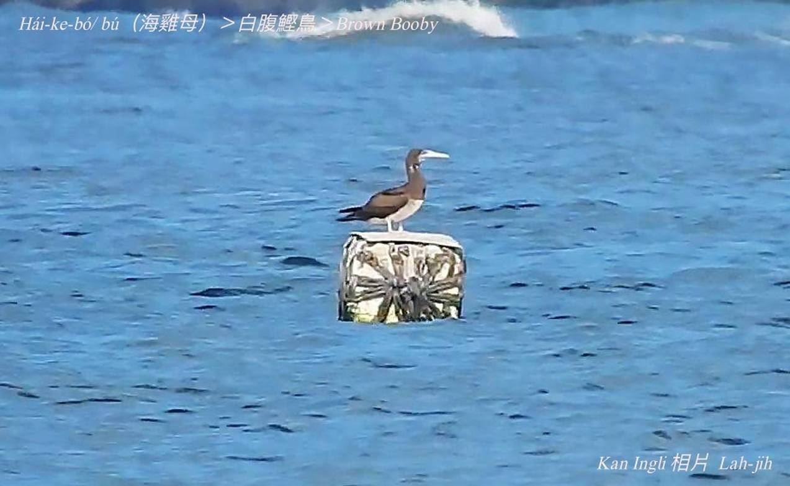
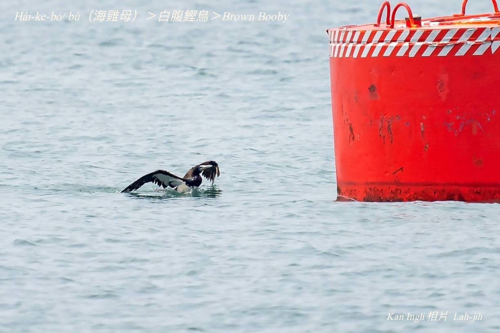

#### 3. Kian-chiáu kho『鰹鳥科-Sulidae』

|台灣名|中譯名|英文名|
|Hái-ke-bó（海雞母）|白腹鰹鳥|Brown Booby|

# 3-1. Hái-ke-bó（海雞母）

Hái-ke-bó（海雞母）是海鳥，腳有蹼（pok），ē泅水，嘴pe pak-tó͘白色，嘴pe長長尖尖像雞嘴pe，所以號做海雞母。Kah意tòa海邊岩石téng-koân，kap海雞母笛鯛kāng名。咱nā講海雞母，大部份人lóng是講海雞母笛鯛。

