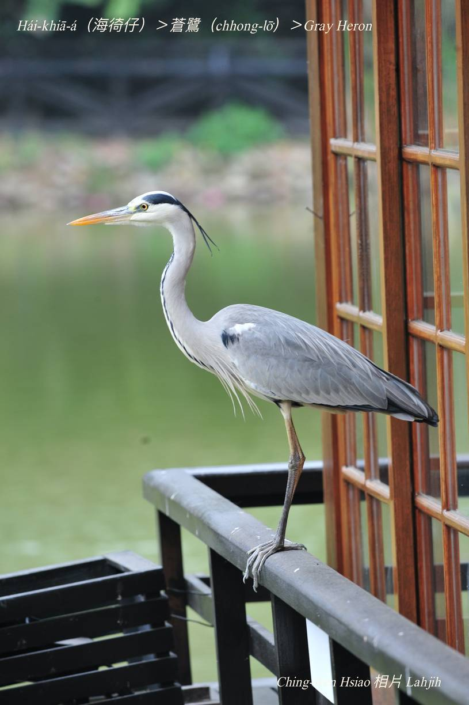
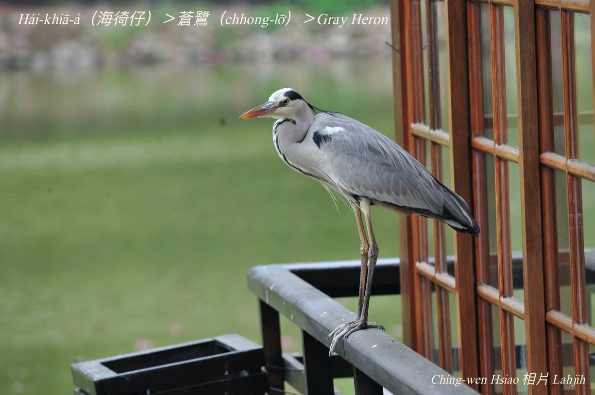
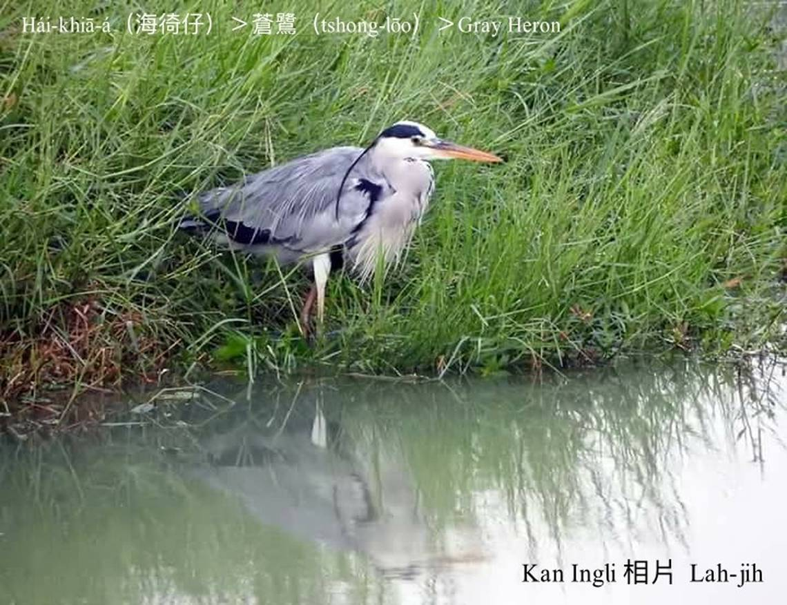
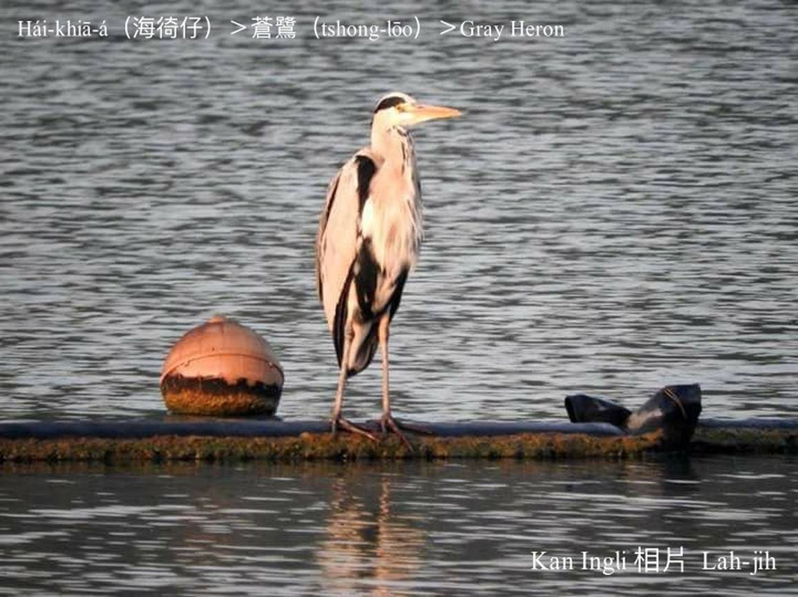

#### 5. Lō͘ kho『鷺科』

|台灣名|中譯名|英文名|
|Hái-khiā-á（海徛á）|蒼鷺（chhong-lō͘）|Gray Heron|

## 5-6. Hái-khiā-á（海徛á）

Hái-khiā-á是hāu-niáu（候鳥）過冬鳥，白色頭殼chhap淺niáu鼠色羽毛lām一寡烏色，嘴pe腳骨黃gâm色，kah意tī鹽埕、làm地、溪口、phû-lūn/ soa-chiu（浮崙/沙洲）liâu水chhōe食。

將ām-kún kiu成z字形到肩胛頭，而且用靈敏ê眼力，等待臘物。
時常用一ki腳khiā--leh，另外一ki kiu tī腹肚下，khiā tiām-tiām等候魚蝦倚近，ē-tàng連續khiā 2-3點鐘，所以叫hái-khiā-á（海徛á）。

# 【Tâi-oân chiáu-á liām-koa-si】

### **Hái-khiā-á hông ho̍at-khiā**

Hái-khiā-á, lí teh hō͘ lâng ho̍at-khiā--hio͘h

Ná-ē siang-kha khiā chê-chê, lóng m̄-káⁿ kóng-ōe 

M̄-sī--lah, m̄-sī--lah

Goán a-bú ū kau-tài, ài khiā-tiàm-chia tán-thāi

Thèng-hāu hî hê nā chhut-hiān

Chi̍t-tǹg chheⁿ-chhau tō piān-piān

