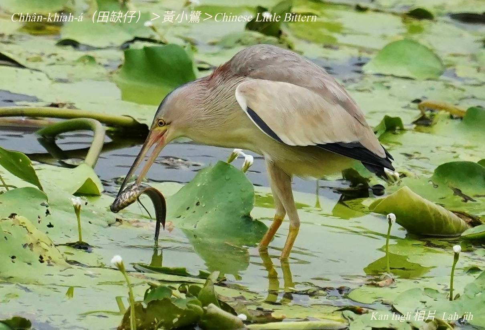
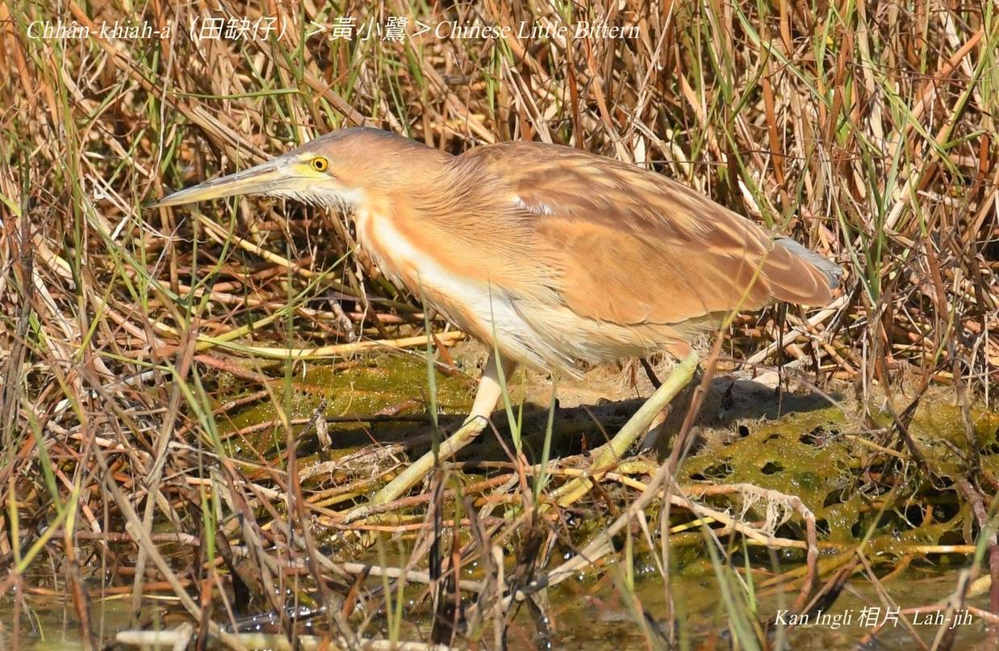
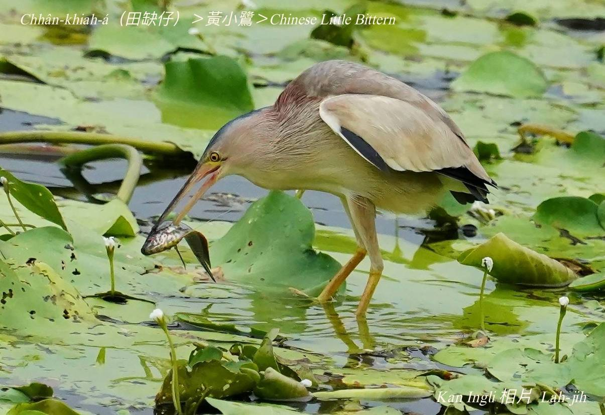
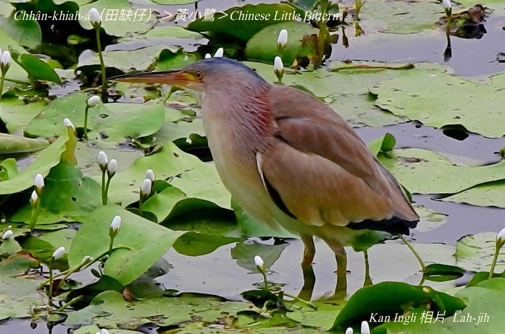
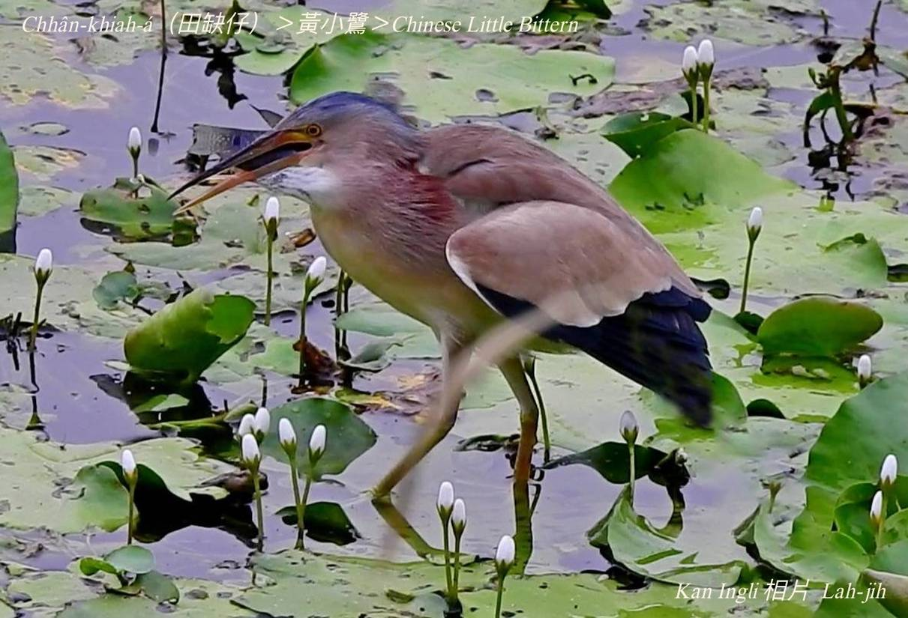

#### 5. Lō͘ kho『鷺科』

|台灣名|中譯名|英文名|
|Chhân-khiah-á（田隙á）|黃小鷺|Chinese Little Bittern|

# 5-7. Chhân-khiah-á（田隙á）

Chhân-khiah-á kah意tī埤塘、làm地、溪口有蘆竹phō水草所在做siū生湠，身軀黃gâm色，襟胸有咖啡色直sûn花紋時常出現tī水田--裡，特別tī田岸有隙ê所在，因為田隙khah有魚蝦鰗鰡，a̍h是水生生物thang食。

Chhân-khiah-á tī水田中、草phō內liâu水chhōe 食，lóng將ām-kún kiu成z字形，所以tī宜蘭人keng-thé一個人kiu-kiu lun-lun，行路ún-ku形，叫做chhân-khiah-á。

# 【Tâi-oân Chiáu-á Liām Koa-si】

### **Chhân-khiah-á Khut Bé-sè**

Chhân-khiah-á, lí teh khòaⁿ-siáⁿ 

Siang-kha khiā chāi-chāi, chhin-chhiūⁿ khut bé-sè

Ām-kún ē chhun-kiu, sok-tō͘ chhiūⁿ chhèng-chí

Siòng-chiong-chiong, khòaⁿ-tio̍h siáⁿ-mi̍h 

Bián tiû-tû, khòaⁿ góa chhùi-pe chiam-tok-tok

Chi̍t chiah chúi-ke-á í-keng thóng ji̍p chhùi

