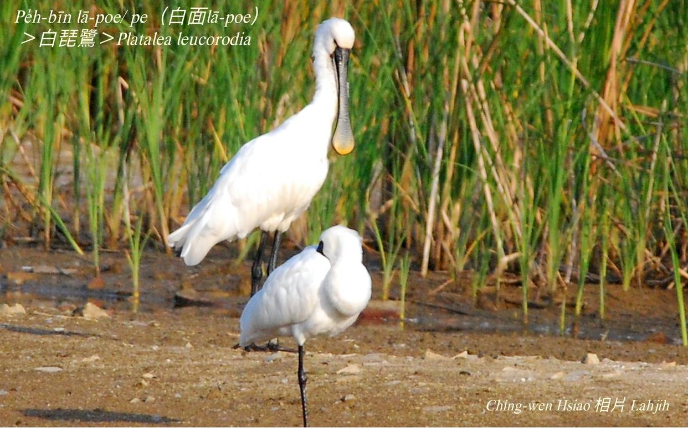
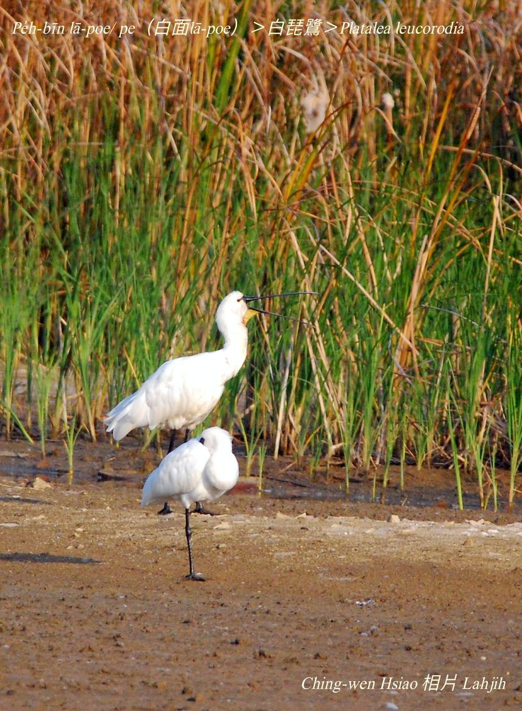

#### 6. Chu-lō͘ kho『朱鷺科』

|台灣名|中譯名|英文名|
|Pe̍h-bīn lā-poe/pe（白面lā-poe）|白琵鷺|Platalea leucorodia|

# 6-2. Pe̍h-bīn lā-poe/pe（白面lā-poe）

O͘-bīn lā-poe/pe，pe̍h-bīn lā-poe/pe lóng是『琵鷺』，因為o͘-bīn lā-poe是固定飛來台灣ê過冬鳥，是giōng-boeh  che̍h-chéng（絕種）ê保育鳥類，數量koh chē，所以ta̍k-ê khah注目關心。

Pe̍h-bīn lā-poe iau m̄是giōng-boeh  che̍h-chéng（絕種）ê保育鳥類，而且每年飛來台灣ê數量無chē。Pe̍h-bīn lā-poe ē lām tī o͘-bīn lā-poe做夥討食。

Pe̍h-bīn lā-poe體型sió-khóa khah大，面模烏色khah少。O͘-bīn lā-poe ê ba̍k-chiu周圍是烏色，pe̍h-bīn lā-poe是白色，無hām chhùi-phóe連做夥。

