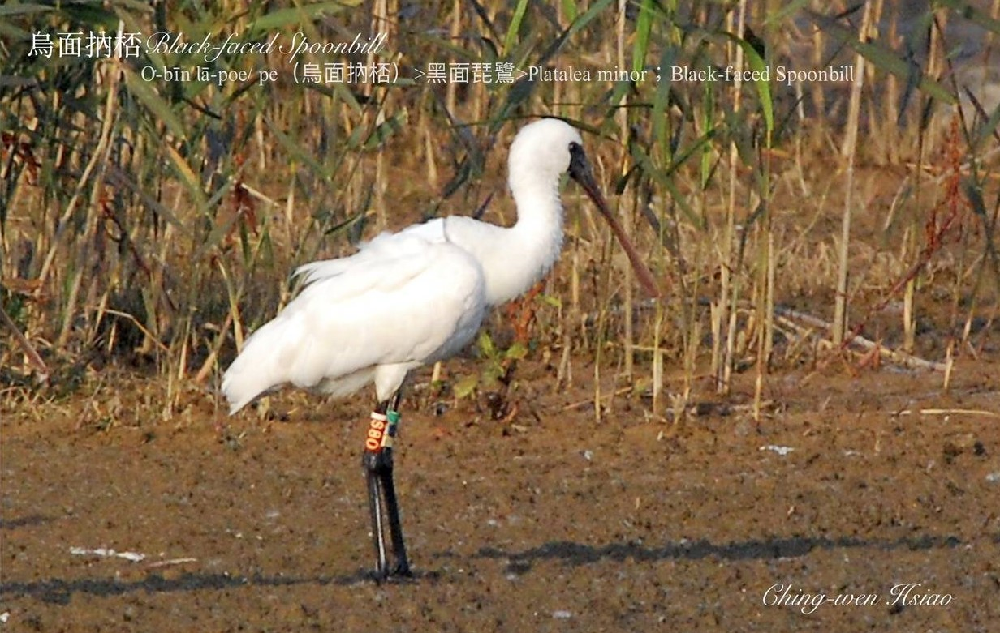
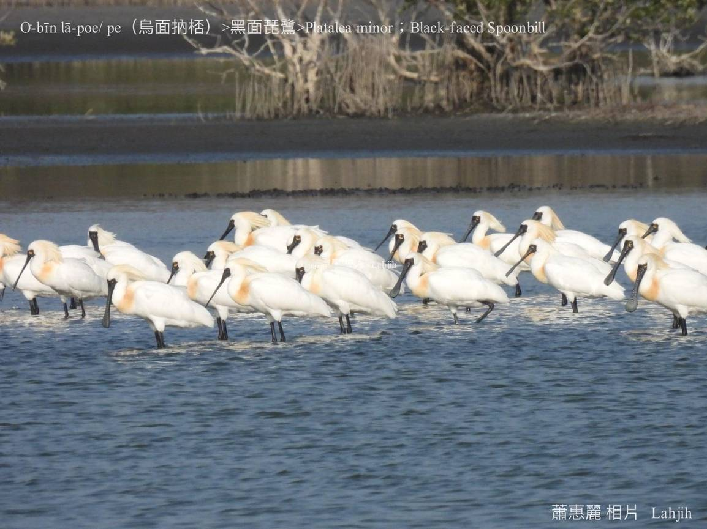
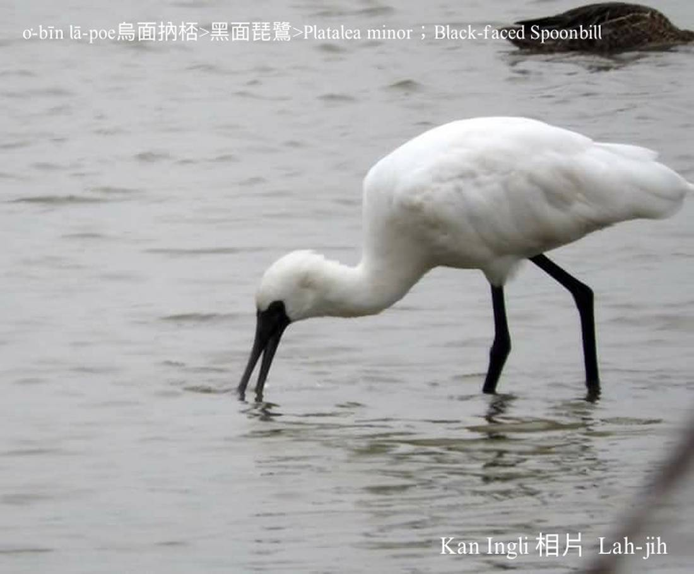

#### 6. Chu-lō͘ kho『朱鷺科』

|台灣名|中譯名|英文名|
|O͘-bīn lā-poe（烏面lā-poe）|黑面琵鷺|Platalea minor（Black-faced Spoonbill）|
|O͘-bīn lā-pe（烏面lā-poe）|黑面琵鷺|Platalea minor（Black-faced Spoonbill）|

# 6-1. O͘-bīn lā-poe（烏面lā-poe）

O͘-bīn lā-poe，伊ê嘴pe像樂器琵琶，中國人ka號做『琵鷺』。

O͘-bīn lā-poe，伊ê嘴pe親像船poe，咱ka號做lā-poe；lā-poe用嘴pe tiàm水--裡lā--chi̍t-ê飛--chi̍t-ê，咱ka號做lā-poe（飛）；宜蘭人看lā-poe ê嘴pe親像飯匙，tiàm海水掃--leh掃--leh，to̍h ka號做掃鵝、飯匙鵝。

O͘-bīn lā-poe是giōng-boeh che̍h-chéng ê保育鳥類，是過冬鳥，每年9-10月飛來七股曾文溪口，隔轉年3-5月離開。

O͘-bīn lā-poe kah意tiàm海岸附近、溪口、內海á潟湖、海埔地、鹹水lòm地、紅樹林chhōe食，hèng食魚蝦ham-á。

### Gín-á歌 —— O͘-bīn Lā-poe

『黑琵鷺』O͘-bīn lā-poe，嘴pe扁扁像船poe，

寒天飛來海埔地，ki-ki kā-kā khioh海螺，

怨嘆所在真正狹，ki-ki kā-kā真liân-hôe。
						

# 【Tâi-oân chiáu-á liām-koa-si】

### **O͘-bīn lā-poe bīn o͘-o͘**

O͘-bīn lā-poe bīn o͘-o͘

Tī Chhit-kó͘ hái-piⁿ-á bóng lā bóng ho͘

Bong nā ū, thâu lê-lê

Ho͘ nā bô, poe--chi̍t-ē khì pa̍t-ūi chhōe

Bián oàn-thàn hái-po͘-tē siuⁿ-e̍h

Lí kám chai 

Lán Tâi-oân, chū-jiân-súi ê só͘-chāi í-keng bô-chē

### 【註解】

|詞|解說|
|琵琶|Jî-pê。|
|潟湖|Sek-ô͘。|
|Che̍h-chéng|絕種。|
|Ham-á|Clam，蚶á。|
