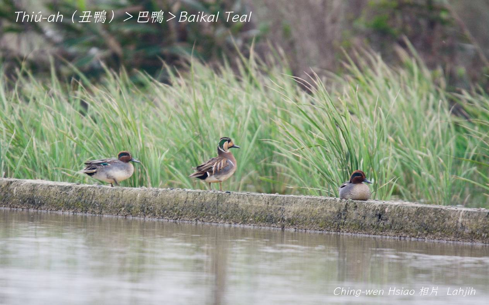
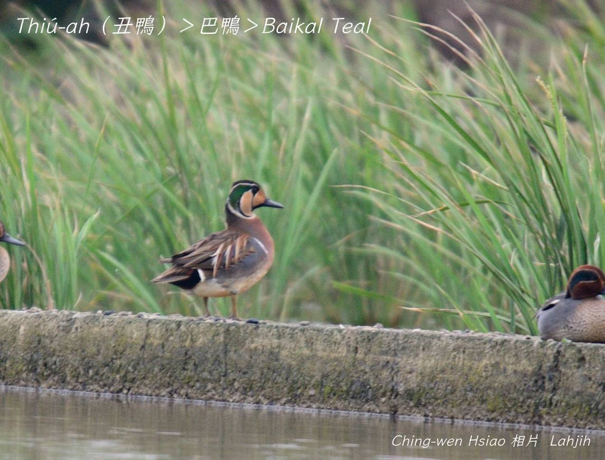
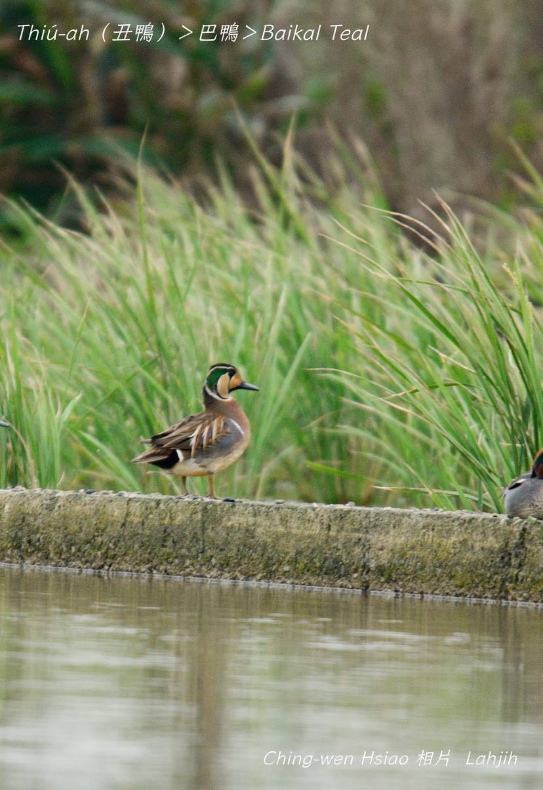

#### 7. Gān-ah kho『雁鴨科』

|台灣名|中譯名|學名|
|Thiú-ah（丑鴨）|巴鴨|Sibirionetta formosa|

# 7-4. Thiú-ah（丑鴨）

公鳥ê面形真sêng做戲ê siáu-thiúⁿ-á，是台灣冬天罕有ê迷鳥，暗時飛來田野、溼地、水池á討食，日--時浮沈tī有水草ê水池歇睏。日本名叫巴鴨。

公鳥面hoe-pa-lí-niau色水chiâⁿ súi，身軀羽毛mā真súi，母鳥生做素素花紋kāng-khoán chiâⁿ súi。
	

### 【註解】

|詞|解說|
|siáu-thiúⁿ-á|小丑á。|

