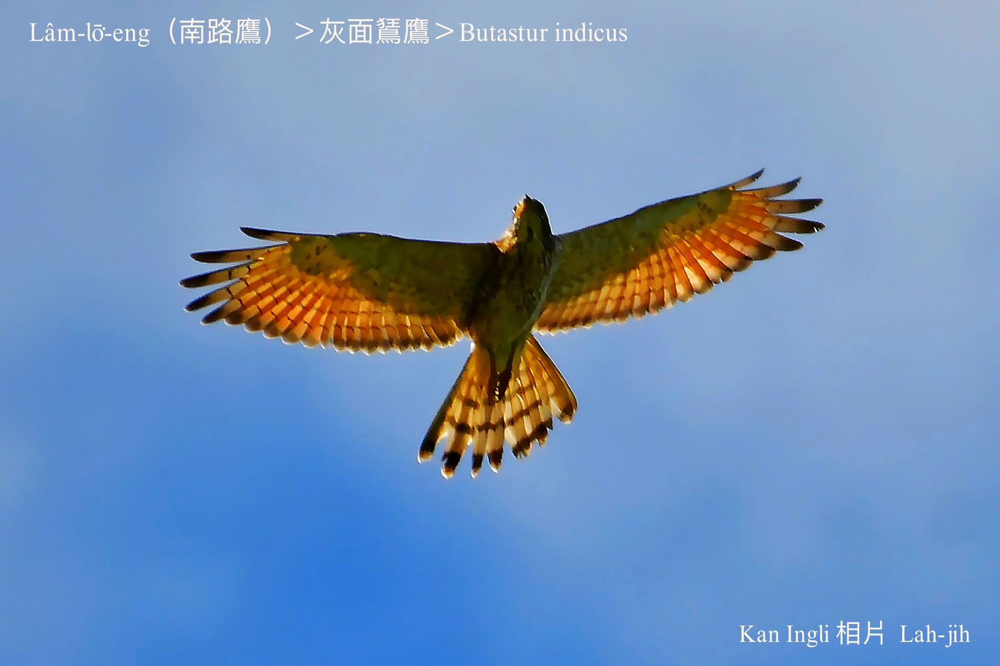
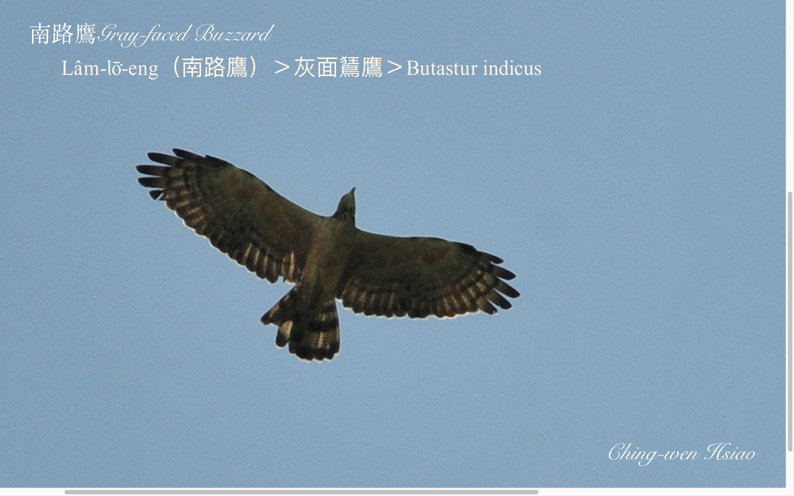
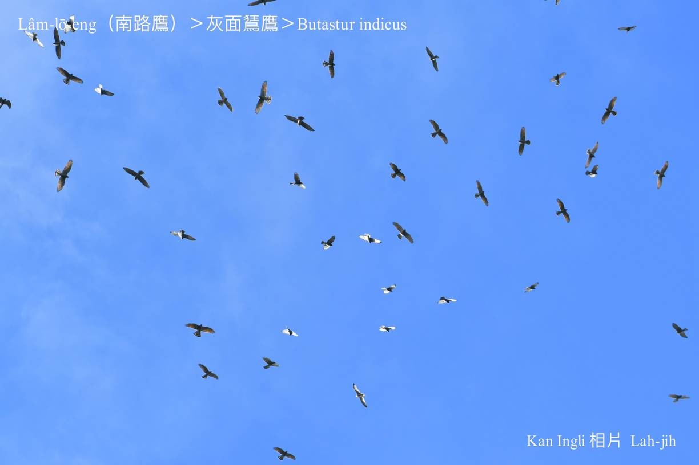
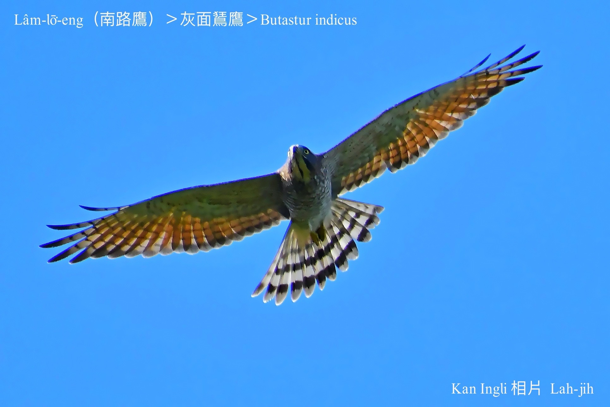
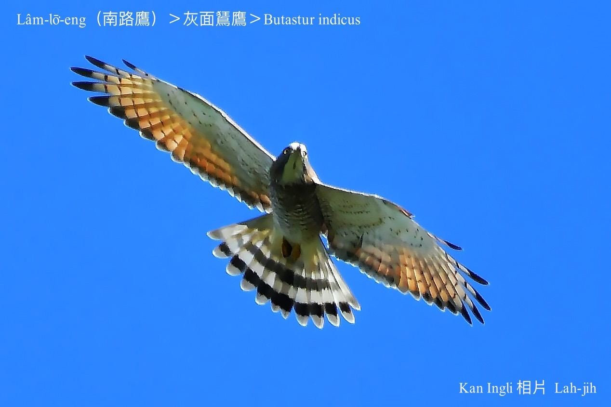

#### 8. Chiū-eng kho『鷲鷹科』

|台灣名|中譯名|英文名|
|Lâm-lō͘-eng（南路鷹）|灰面鵟鷹|Butastur indicus|

# 8-5. Lâm-lō͘-eng（南路鷹）

Lâm-lō͘-eng tī台灣是過境鳥，少數是過冬鳥，嘴pe倒鉤利劍劍，hèng食小型動物，數量比鷹柱鳥khah少，因為南路鷹ē seh圓kho͘-á飛行，khah早koh時常hō͘人lia̍h來做標本、piak鳥á pa，tī台灣是真有故事ê鷹鳥。

Lâm-lō͘-eng每年十--月經由南台灣滿州鄉，過境飛去東南亞heⁿh寒過冬；隔轉年清明前後chiah koh飛轉來彰化八卦山kap大肚山台地暫時歇睏。屏東Báng-sut號做山後鳥，彰化人kā in叫做南路鷹。

	

### 俗語

「南路鷹，每年一定轉來哭清明。」

（有「清明鳥」ê稱呼。）

「南路鷹，一萬死九千。」

（八卦山、滿州鄉，自古以來to̍h有tng lia̍h南路鷹，piak鳥á pa ê pháiⁿ習慣。）

### Lah-jih小說

### **〈鷹揚八卦——南路鷹，一萬死九千〉——蕭平治**
>**（1999.4.10寫2001.2.4修改。）**

「各位房長，各位兄弟，ta̍k ê koh勞煩巡巡看看--leh！看有tòe 無著陣、身苦病痛、傷過thiám 頭--ê -bò͘？一chōa路飛kah chiâⁿ勞苦，taⁿ已經來到Formosa中部地界，下面to̍h是出名濁水溪，濁水溪過--去ta̍k ê tio̍h 小chhèng kôan 淡薄--à，咱借春天ê 風勢，然後放hō͘ 伊輕鬆á飛，像chhū行機、三角翼按呢慢慢á chhu--落去，liâm-mī to̍h到半線地頭。八卦山脈ê 地形位置掠hō͘ 好，掠hō͘ 準，hia有一仙大佛為記， m̄-thang bē 記得。

A-éng！你做頭前趕去八卦山頂探--一下，看有siáⁿ-mih動靜--bò͘？是m̄ 是有鳥á踏，抑是天羅地網，趕緊轉來報告。」

「Êng-á 叔公！我知影，阮隨時to̍h來去！」 負責探路顧安全ê A-Éng 隨時chhōa 五六ê兄弟，ǹg北一直衝，負責ê 精神hō͘ 總領隊A-êng 感覺真放心。

無一tah 久á，探路先鋒A-éng in 已經斡倒轉--來：

「報告Êng-á 叔公！天氣chiâⁿ 好，風chiâⁿ 順，八卦山頂好光景，今á日koh是禮拜日，有足濟人來tī 大佛附近leh 散步thit-thô 看光景，ta̍k ê lóng笑bi-bi，歡歡喜喜，無siáⁿ-mih掛慮，而且樹林內mā無看著鳥á踏 kap 鳥網á，做咱放心kā 紮營無問題。報告完畢！」

「猶有其他 koh 樣 ê 狀況--bò͘？」

「有人ê 所在真鬧熱，無人ê 樹林內 kan-nā 有一寡鳥隻tī  hia chhi-chhi chhū-chhū，唱歌lā 曲、phōng-chhiak 跳舞，快樂ê 心情比人無較輸。」 想bē 到A-éng 觀察 chiah 入心 chiah 詳細。

「各位房長，各位兄弟：逐家注意聽，紮營ê 營地八卦山tih-beh 到，大佛 tī 頭前hia有看著--ho͘ⁿh，各房隊長隊伍小整理--一下，chhōe 較iap-thiap ê 樹林內紮營，m̄-thang  siuⁿ óa 車路邊，車路邊人濟、車濟chiâⁿ危險，而且siuⁿ chhap-cha̍p  siuⁿ鬧熱ē hō͘  gín-á驚--tio̍h，按呢知影--ho͘ⁿh？準備紮營…」

一chōa路飛來千外里，有夠thiám，Êng--ā 想 boeh 小歇睏--一下，無，hia ê 猴gín-á liâm-mī iū-koh吵 beh 聽講古，to̍h無 thang 歇喘--lò͘ 。

「Ŏe~！bān-chhiah-sī--leh lah！危險--ò͘！各位隊長，趕緊叫ta̍k ê koh飛kôan，m̄-thang 落基地，有聽見--bò͘？危險--lah⋯」開路先鋒A-Éng hit 五六ê兄弟緊張kah 凊汗一直流，喝kah giōng-boeh sau 聲，hoah-hiu了後，趕緊chhōe 總領隊參詳：

「Êng-á 叔公！較緊 khit 來！你看 he 體育場東pêng，hia ê 人群是leh chhòng-saⁿh？ i-i o-o，hán hán hoah hoah，也有chhāi 旗á，也有搭布棚á，有人提吊鏡（望遠鏡），有人 kí-kí chí-chí，每粒頭殼lóng khiàn-thian khiàn-thian 看tùi 咱chia來，大概無好空ê 款，看破趕緊斡方向，徙tùi 別位--來去！」

「張持無蝕本，恁ê 顧慮chiâⁿ tio̍h，m̄-kú taⁿ臨時臨iāu boeh 徙去toeh ？…小等--一下，緊事khoaⁿ 辦，mài 急mài 緊張，hō͘ 我斟酌看詳細，chiah 做決定。」

「Hò͘！」

Êng--ā 有影是老經驗，總領隊to̍h是總領隊，實在無簡單，看伊老神在在，飛tiàm 半空中翼phiat--leh phiat--leh，thián 開伊利劍劍ê 鷹á目，巡視八卦山頂每一跡，尤其是人濟ê 所在，伊特別chim-chiok，特別注神tī 人ê 穿插kap 面腔目神，看in  ta̍k ê穿kah sui-tang-tang，m̄ 是休閒服，to̍h是運動衫褲，面容像春天ê 花蕾，歡頭喜面，不時都看對有鷹á ê 所在，嘴笑目笑，比比指指；ah！有--ā！『鷹揚八卦』 ê 橫批隨風 phia̍t 來phia̍t  去，ah！he 是leh 迎接咱來到位--ê -lah！

是leh 迎接咱--ê無m̄ 著！ka siòng較真--leh！koh有幾ê-á熟似面--ê lioh，tio̍h！he to̍h是愛咱鳥á族ê 『鳥盟』 人士，ah！mā有外國人--neh，lóng是 leh 迎接咱！lóng是 leh 歡迎咱！莫怪 chiah-ni̍h 鬧熱，人chiah-ni̍h 濟，比舊年有較濟無較少。

Êng--ā kui-ê 心肝頭開了了，心情做一下輕鬆--khit 來，taⁿ 免驚，kap 舊年kāng一樣，有驚無危險：

「Éng--à！趕緊廣播，請ta̍k ê免著驚，放心ka安營，he 是leh 歡迎咱--ê，做恁免驚，bē kā 咱害--lah！in chiah-ni̍h 大陣人集合tī chia，to̍h 是等 boeh看咱ê 風釆，boeh 欣賞咱ê 技術，優美飛行ê 姿勢。

Kau-tài--落去，叫ta̍k ê bān-chhiah-sī歇睏，表演hō͘  in 看，看咱鷹á族ê hiâu-pai ，無論飛kôan 飛 kē，孤一隻抑是掠相排，thián翼 飛chiūⁿ天，抑是iap 尾衝落地，se̍h 圓箍á、chhia-pùn-táu pha-chhia-lin，若歡喜就做恁kĭ！kĭ！kĭ！唱出歌聲hō͘ in 聽，免客氣免驚惶，隨在恁chông，隨在恁kek-khong，人客看了若爽，to̍h無枉費咱來chit-chōa路，來chia kā in chak-chō--lò͘！」

自按呢天頂kap 地上做夥hi-hi hoa-hoa，喊喊喝喝，鬧熱滾滾，歡喜寫tī 面腔，天頂飛kah chhiāng-chhiāng  滾，八卦山頂ê 每一人lóng歡喜kah笑bún-bún。Êng-á 叔公in 鷹á族今á日上歡喜，台灣人ê 面子今á日趁了上富裕，『鷹揚八卦』自按呢出名到國外。

「阿公！你今á日siāng-kài歡喜--ho͘ⁿh！」 boeh-àm-á鷹á族安營好勢，八卦山頂回復tiām靜，chhun  hia ê 細隻鷹á猶 leh 無時閒，ki-ki kā-kā 一直吵總領隊Êng-á 叔公tio̍h-ài講古hō͘ in 聽：「Tiāⁿ-tio̍h有故事 boeh 講hō͘ goán聽--e，阿公！阿公！阮 boeh 聽你講古--lah！……Ta̍k ê pho̍k-á 聲ka chhui--lo̍h-khì！阿公 boeh 講古hō͘ 咱聽--a！」

pho̍k！pho̍k！pho̍k！pho̍k！pho̍k-á 聲phah無停…

「好！好！好--lah！boeh 講to̍h來講，boeh聽to̍h tiām-tiām-á聽，m̄-thang  koh一直吵：

古早古早，咱ê 祖先 tòa-tiàm 北方真遠真遠 ê 所在，為著 boeh hō͘ 咱 ê kiáⁿ孫有較好 ê 生活環境，每年lóng tī 秋天時 ùi 咱 ê 故鄉起程，飛向南旁 boeh 去南洋度假， sūn-sòa kā 恁chia ê 序細飼hō͘ 大漢koh健康，教恁生活ê 才調，hō͘ 恁家己ē-tàng獨立，tī 隔轉年 ê 春天，chiah koh chhōa 恁轉去故鄉，kā 恁完成婚事，生湠咱ê 族群，保持咱Lâm-lō͘-eng（Butastur indicus）ê 傳統 kap 特質。

每一年 tī 落南抑是上北ê 路--nih，咱lóng ài 借台灣 chit 塊 Formosa 土地暫時歇睏，習慣上落南歇tī 屏東、恒春一帶，chiūⁿ 北就歇 tī 咱chit-mái 歇睏 ê 八卦山頂。」

「阿公！阮較愛歇 tī 彰化 ê 八卦山頂，無愛歇屏東 kap 恒春。」

「為siáⁿ-mih？」

「八卦山頂有人歡迎，好sńg 好thit-thô，屏東恒春hia chiâⁿ 危險，有鳥á-tah，mā有網á ē hō͘ goán bē tín 動，有夠驚死人--ê neh！」

「恁gín-á人m̄ 知影鳥á-tah kap 鳥網á有外厲害，kan-nā知影ē hō͘ 恁 bē tín 動，無thang sńg，無thang thit-thô--niâ，he是boeh ti̍h 咱ê 生命，恁kám知？」

「有影--ò͘！ah tī 半線八卦山頂，ná-ē lóng無鳥á-tah kap 鳥á網？koh有hiah 濟人來欣賞咱ê 飛行，按呢m̄-chiah 有趣味好thit-thô。」

「是時代 leh 進步，人類已經有保育ê 觀念，知影保護咱chia ê 歹命鳥，古早時代咱 ê 祖先to̍h無chiah-ni̍h 好運，每一年見若飛來到台灣停腳暫歇睏，to̍h去hō͘ in 剿kah giōng-boeh 斷種，恁敢知？「南路鷹，一萬死九千」…aih！」

突然間，Êng-á 叔公soah目箍紅紅，目屎一大滴一大滴liàn--落來…

「阿公！你ná leh 流目屎？」

Êng--ā 無kā in 應聲，繼續講落去：

「想著祖先ê phah-piàⁿ，為著生存，為著尊嚴，無惜生命，甘願犧牲認命，aih！lóng是人ê 無知，soah hō͘ 咱世世代代liân-hôe 歹命。

古早古早，咱ê 祖先to̍h教咱愛tòe節氣搬徙，寒天時，咱ê 故鄉寒 sih-sih，chiâⁿ pháiⁿ徛起，m̄-chiah 隨人組隊，趁冬季猶未到ê 秋天，千里迢迢飛過海洋到南洋度假，sūn-sòa教恁技藝，kā 恁chhiâⁿ 大漢，chiah koh趁熱--人boeh 到chìn前ê 春天，搬徙轉來去故鄉，hō͘ 恁少年--ē 完婚生湠，che to̍h 是祖先留落來ê 傳統，不幸每一kái 經過 Formosa 地界，to̍h-ē去遇著「南路鷹，一萬死九千」ê 災厄，mā是宿命無奈，hó-ka-chài，chit-mái ê 台灣人已經覺醒，進入文明社會，有野生動物保育ê 觀念，而且經過一寡有心 ê 愛鳥人kap 彰化縣政府ê 認真宣傳，得著國際保育界ê 重視， m̄-chiah 有chiah-ni̍h  鬧熱hō͘ 人感心ê 活動，ǹg望明年、後年，一直到以後，咱ê 後代囝孫，lóng-ē親像今á日按呢，平平安安，順順序序來過日，無驚惶，無死傷來經過 Formosa chiah-ni̍h súi ê 地界，免歡迎無要緊， mài kā 咱thâi，mài kā 咱掠就真感謝。」

「阿公！ná-ē kā 咱叫做南路鷹--leh ？」

「Che是in ê 祖先，看咱逐年都ài 飛向南洋去，m̄-chiah 按呢kā 咱稱呼，無pháiⁿ意--lah！taⁿ chiâⁿ暗--à，tòe 阿公祈禱了後tio̍h-ài去睏，bîn-á 早起tio̍h-ài koh chiūⁿ路，無，ē peh bē khit 來。」

「好！」

「感謝天！感謝地！感謝上帝！賜hō͘ 咱平安，賜hō͘ 咱歡喜，過去--è mài koh鬱卒，未來--ē，tio̍h-ài phah-piàⁿ sè-jī。感謝台灣人，感謝半線ê 兄姊，恁ê 仁慈，恁ê 疼心，阮ē記得，願  恁mā ē-tàng平安快樂，免受恐嚇，免受壓霸，khioh 回尊嚴，tio̍h-ài家己piàⁿ！感謝！感謝！感謝！」

### 【註解】

|詞|解說|
|Báng-sut|滿州。|
|吊鏡|Tiàu-kiàⁿ，『望遠鏡』。|
|Chhū行機|『滑翔機』。|
|三角翼|Saⁿ-kak-si̍t，『三角翼』。|

