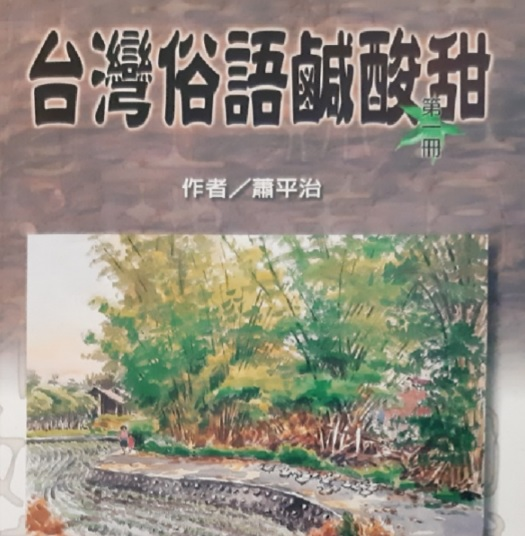

{:h="50%" w="50%"}

## 網站紹介

Chit ê網站是為tio̍h **Siau Lah-jih（蕭平治）**先生ê著作**《Hêng góa Tâi-oân Chiáu-á Miâ（還我台灣鳥á名）》**來設--ê。

> 特別感謝Lah-jih兄，做台語文長期ê實踐者，koh無私奉獻伊ê智識。

邀請大家做夥來讀《還我台灣鳥á名》，欣賞台灣鳥á ê súi-tang-tang kap台灣鳥á ê在地名。

感謝Kan Ingli老師、廖淑鳳老師、林春吉老師，蕭--姓親堂蕭惠麗、 蕭文章、Ching-wen Hsiao提供台灣鳥á相片。有恁ê支持pang-chān，chiah ē-tàng順利上網，介紹台灣鳥á ê在地名，功德無量。

## 版權告白
* 本網站內底ê內容著作權屬原作者 Siau Lah-jih（蕭平治）先生。
* 所有ê資料單單tī網站頂面thang看，是beh利便社會大眾學習台語文，**歡迎自由分享chit ê網站ê網址**。
* 網站kan-na ē-tàng非營利使用。所有ê資料khioh起合理引用、a̍h是宣傳、教學ê路用，bē-tàng koh用任何形式the̍h去別位使用。作品內底ê羅馬字一定ài使用白話字（Pe̍h-ōe-jī），bē-tàng轉換做其他系統。
* 著作權 © Siau Lah-jih（蕭平治）

## 計劃團隊
* 作者、指導：Siau Lah-jih（蕭平治）
* 共同發起人：Siau Lah-jih（蕭平治）、Chhòa It-bîn（蔡逸民）、Koa-ông Péng-hun、Tân Chu-hôa、Tân Sió-tâi
* 總編輯：Tân Sió-tâi
* 校對、編輯：Chhòa It-bîn（蔡逸民）、Koa-Ông Péng-hun、Tân Sió-tâi
* 網站程式：Ngô͘ Hê-bí
* 網站維護：Tân Chu-hôa
* 協助單位：Tá-káu Tâi-gí-bûn Chhiok-chìn Hia̍p-hōe（打狗台語文促進協會）

## 建議、聯絡
Nā網站內容有任何問題a̍h是建議，請聯絡網站負責人 Tân Chu-hôa。

    電子phoe：tzuhua818@gmail.com
